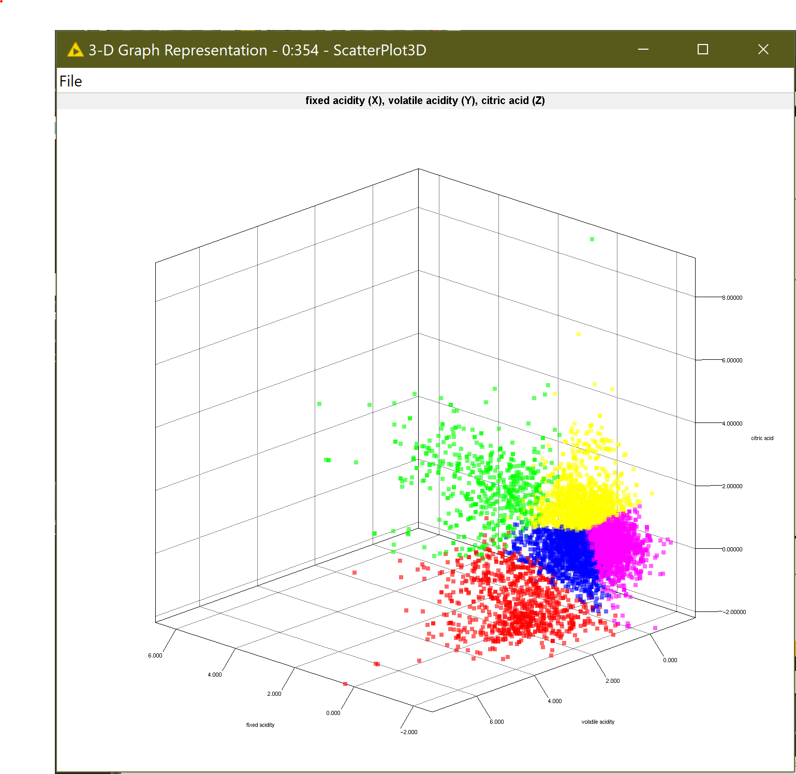
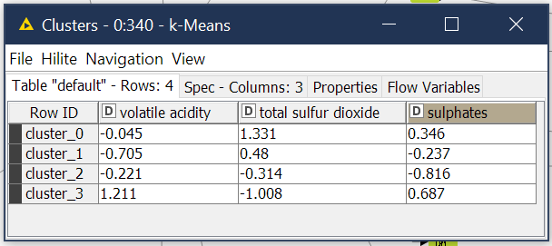
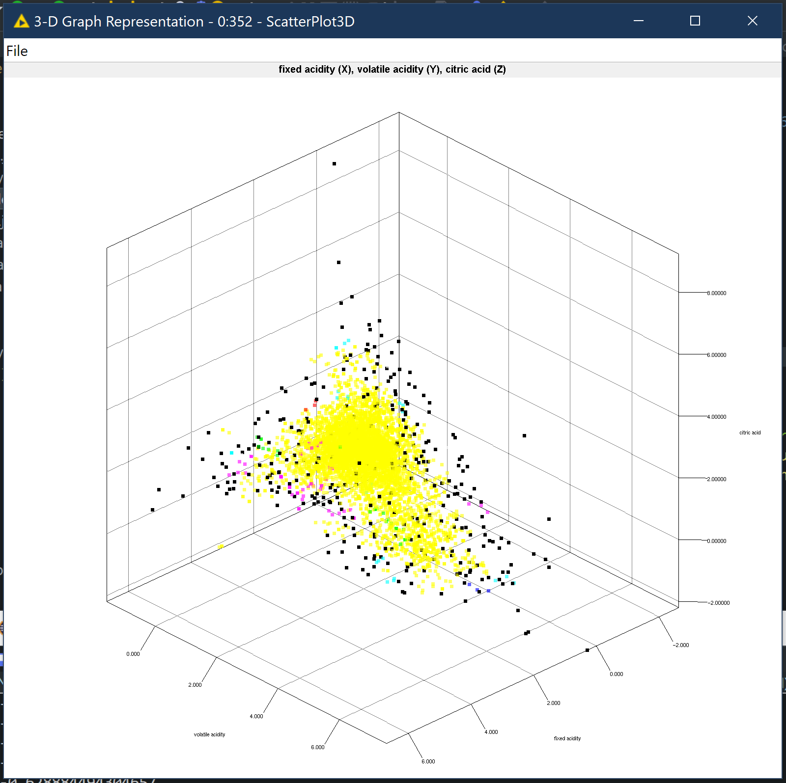
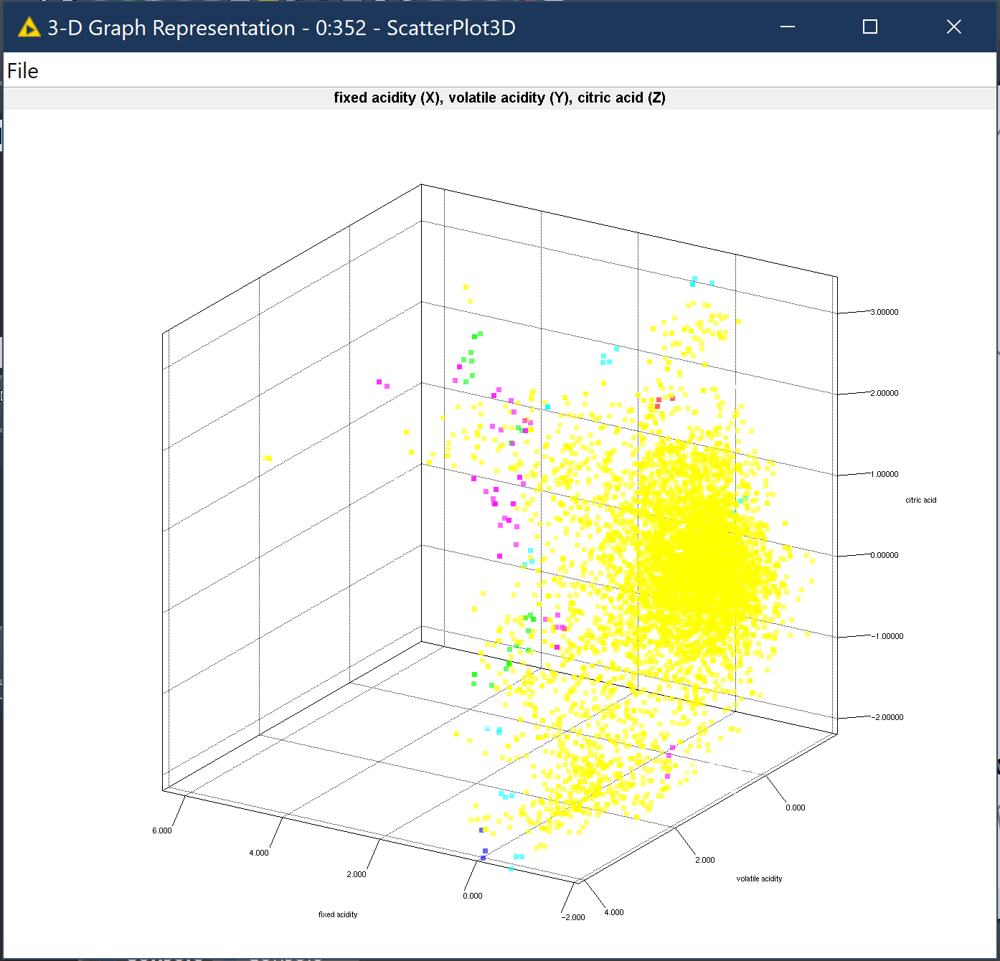
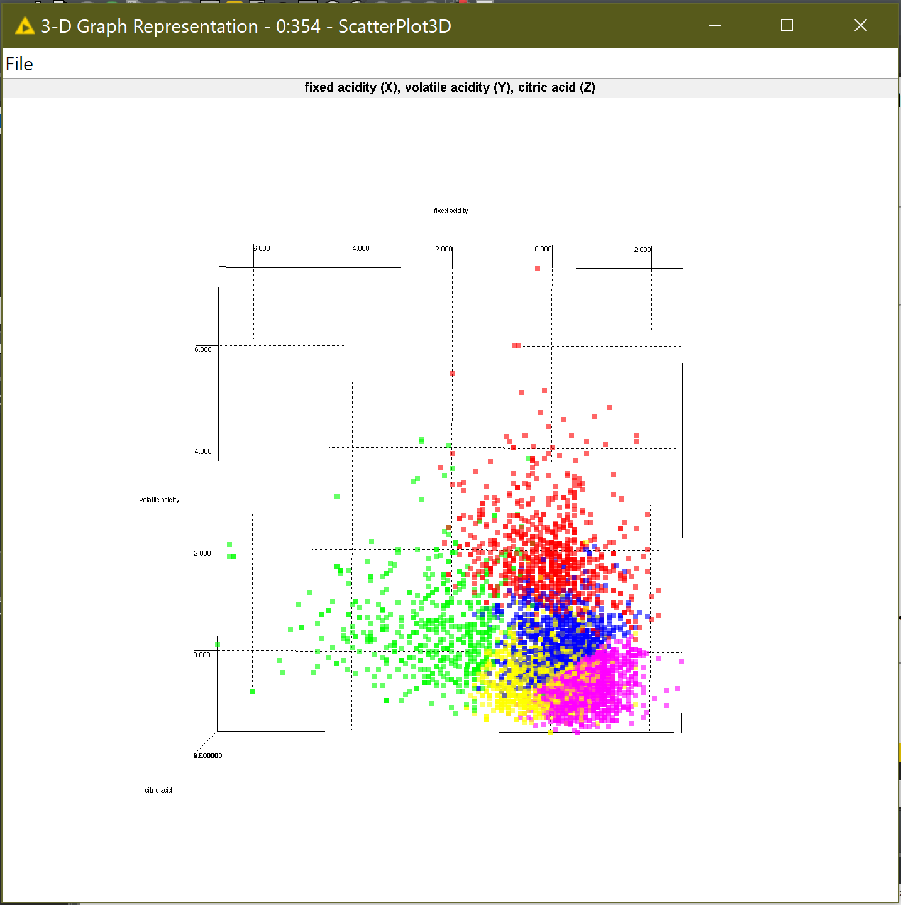

# 3D_Scatter_Node
3-Dimensional scatter plot node compatible with KNIME analytics platform. Focusing on Eclipse plug-in 3rd party client compatibility.

_Visual representation of data plotted after being clustered by a Fuzzy C-Means node. Note the color variations denote different clusters._
This node plots three columns (x, y, z variables) in 3 dimensional space displayed as a moveable, exapandable and rotating graph. It also allows for the colorization of data points based on their cluster membership, as determined by a previous clustering process. Currently, this node will colorize data clustered by K-Means, Fuzzy C-Means and DBSCAN nodes. When operating on K-Means clustered data, you may also pass the prototypes table to the second In-Port to graph the cluster prototypes in 3D space and alter their appearance so they stand out from the table data. Other options are described below.

# Options
## Standard Options

### Column Selection 
Choose three columns from the data table to serve as the X, Y and Z axis variable in the 3D Graph.

_Data that has not been preprocessed, viewed in three-dimensions._
### Clustered Data
If the data has been previously clustered by a K-Means, Fuzzy C-Means or DBSCAN node, then selecting this option will enable the full suite of clustering options and allow for colorized cluster representation in the graph.

_Data table that has been previously processed and clustered by a Fuzzy C-Means Node._
### Cluster Type
Select the method of clustering used on the data table. This will enable different settings depending on which type of clustering has been performed (such as filtering data whose cluster membership belongs to the "Noise" cluster for DBSCAN). Be aware, that incorrectly selecting the cluster type may cause issues during execution.
### Number of Clusters
Provide the number of clusters found in the custering operations previously performed. NOTE: if providing DBSCAN data, do NOT include the "Noise" cluster in this total (ex: 4 clusters and 1 "Noise" cluster have been identified, enter 4"). 

_Example K-Means calculated prototypes table_

_Example of clustered data plotted with the associated prototype table. The larger, dark points are the prototype models._
### Prototype Table Provided
Select this option if the method used (and also identified above) is K-means clustering AND you have provided the matching prototype table at the 2nd In-Port. This table will have been created as an Out-Port table by the K-Means clustering node.

## View Options

### Plot All Real Data Points
Select this option if you wish to have 1 : 1 data points on the graph to rows of data in the provided table. Unselect if you wish to specify the number of points plotted in the next option.
### Number Of Plotted Points
Enabled when the previous option is not selected, this option allows you to set the number of rows from the data table you would like represented as points on the graph. NOTE: If you are providing a DBSCAN clustered data set and have correctly provided the requisite settings, the number of points plotted will skip members of the "Noise" cluster if you have selected to not plot them and indlude them in the count is that option is enabled.

_DBSCAN plotted with noise._

_DBSCAN plotted without noise._
### Plot Members of the "Noise" Cluster
The option is enabled when you have indicated your data table was clustered using the DBSCAN algorithm and selecting this option will plot members of the "Noise" cluster, whereas un-checking this option will only plot members of defined clusters to allow for more distinct visual groupings.
### Point Size
Select the size (in pixels) of each individual point on the 3D graph.
### Prototype Point Size
Enabled when you have indicated a K-means clustered data set and provided a prototype table, this view option allows you to specify the size of the prototype points on the graph to allow for better distinction between data and prototypes.
### Prototype Point Color
Enabled when you have indicated a K-means clustered data set and provided a prototype table, this view option allows you to specify the color of the prototype points on the graph to allow for better distinction between data and prototypes.
### "Noise" Cluster Color
Enabled when you have indicated a DBSCAN clustered data set, this view option allows you to specify the color of members of the Noise cluster on the graph to allow for better distinction between clusters and noise.

# Port Information
## In-Ports

### #1 - Data Table
Table of data to plot in 3-Dimensional space. This table must have at least 3 numeric columns (x, y, z axis) and may be the output table from a clustering node if you wish to color the data by cluster.
### #2 - Prototype Table (Optional)
Prototype table created by a K-means clustering node. Please ensure proper settings configuration prior to execution.

## Out-Ports

### #1 - Data Table
Original data table (unaltered) from In=Port #1.

# Views

_Fuzzy C-Means Clustered Data Viewed from the bottom._
## 3D Graph Representation
An interactive 3-Dimensional representation of provided data points (and optional cluster prototypes) which can be rotated and scaled.
